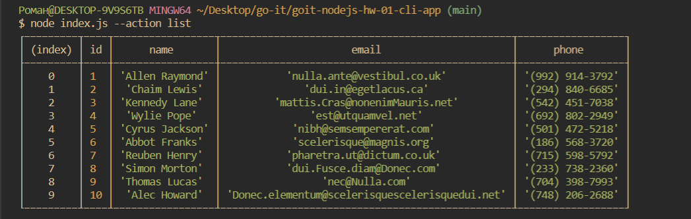
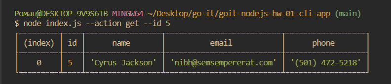
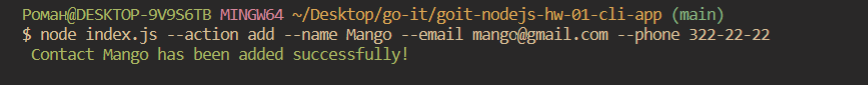
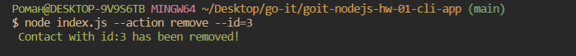

# goit-nodejs-hw-01-cli-app

# NODE.JS CLI APPLICATION

## Examples:

### Requesting the list of contacts using console.table

node index.js --action list

### Getting contact by ID

node index.js --action get --id 5

### Adding contacts

node index.js --action add --name Mango --email mango@gmail.com --phone 322-22-22

### Deleting contacts

node index.js --action remove --id=3

